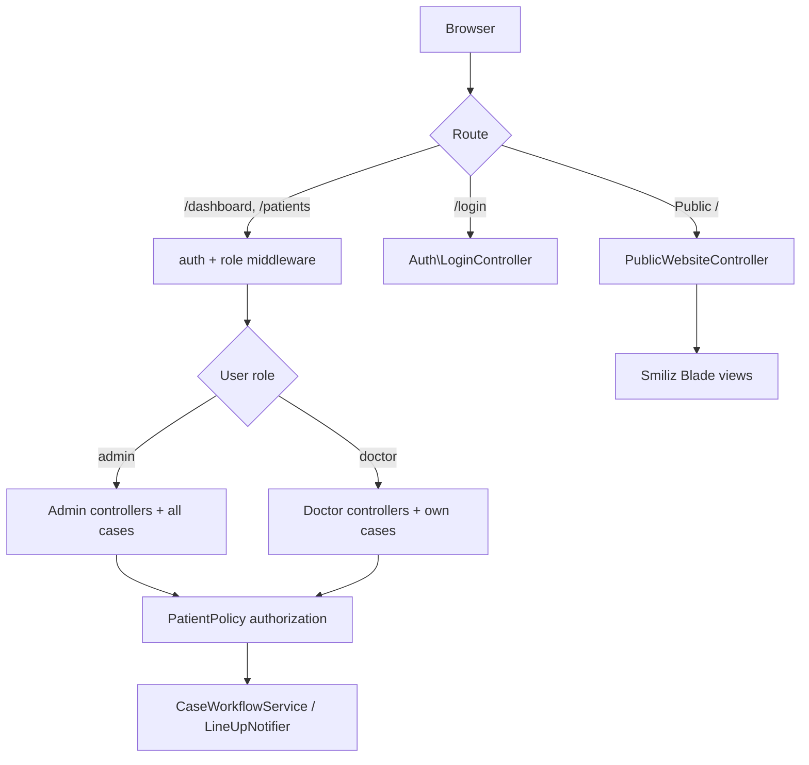
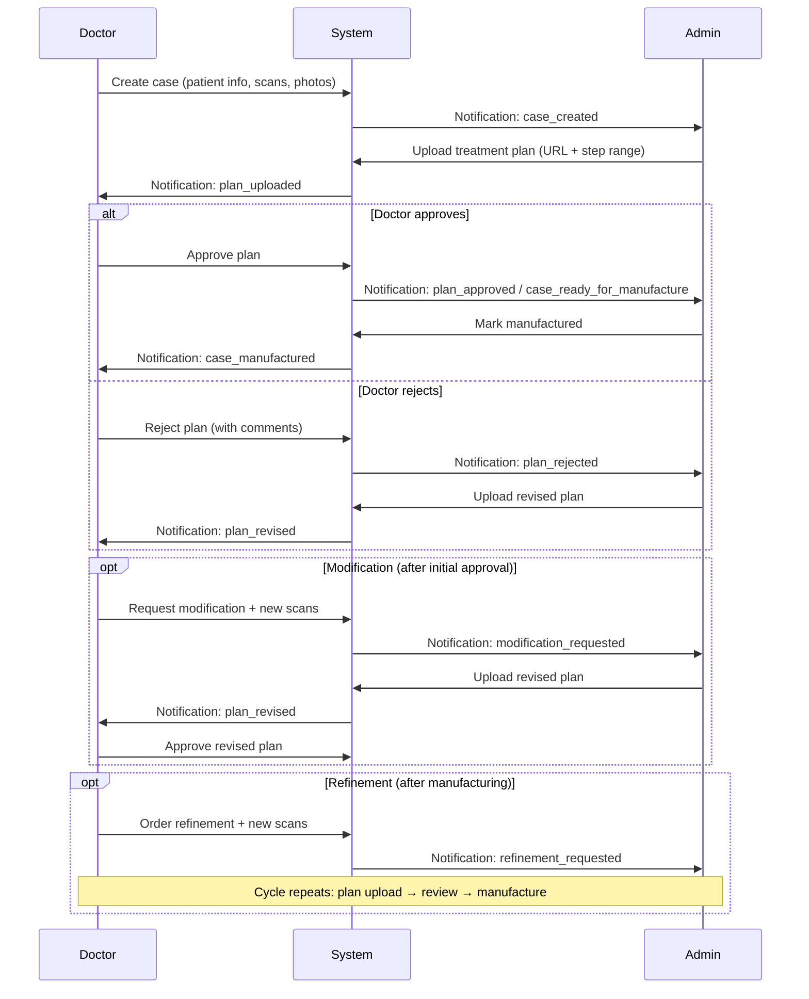

# LineUp Aligner — Technical Documentation

Complete reference for developers and operators: architecture, doctor–admin workflows, and deployment (local + production).

---

## Table of Contents

1. [Project Overview](#1-project-overview)
2. [Technology Stack](#2-technology-stack)
3. [Architecture & Directory Structure](#3-architecture--directory-structure)
4. [Authentication & Authorization](#4-authentication--authorization)
5. [Data Model](#5-data-model)
6. [Doctor ↔ Admin Workflow](#6-doctor--admin-workflow)
7. [Notifications](#7-notifications)
8. [Public Marketing Website](#8-public-marketing-website)
9. [Routes Reference](#9-routes-reference)
10. [Local Development Setup](#10-local-development-setup)
11. [Production Deployment (Hostinger)](#11-production-deployment-hostinger)
12. [Environment Variables](#12-environment-variables)
13. [Maintenance & Troubleshooting](#13-maintenance--troubleshooting)
14. [Key File Index](#14-key-file-index)

---

## 1. Project Overview

**LineUp Aligner** is a dental aligner case management platform. Doctors submit orthodontic cases (patient data, 3D scans, clinical photos); LineUp administrators upload treatment plans, coordinate manufacturing, and manage the public marketing website.

The application has three surfaces:

| Surface | URL prefix | Audience |
|---------|------------|----------|
| **Public website** | `/`, `/ar/*` | Visitors, prospective patients |
| **Doctor portal** | `/dashboard`, `/patients`, … | Clinic doctors |
| **Admin portal** | Same login, role-based UI | LineUp staff |

Default seeded accounts (after `php artisan db:seed`):

| Role | Email | Password |
|------|-------|----------|
| Admin | `admin@lineup.com` | `password` |
| Doctor | `doctor@lineup.com` | `password` |

> **Note:** The root `README.md` is outdated (still references "Oreo Hospital"). This document is the current source of truth.

---

## 2. Technology Stack

| Layer | Technology | Version / Notes |
|-------|------------|-----------------|
| Framework | Laravel | 13.x (`^13.8`) |
| Language | PHP | `^8.3` |
| Database | MySQL | 8+ (default connection) |
| Auth | Session-based | `web` guard, sessions stored in DB |
| Cache / Queue | Database drivers | `CACHE_STORE=database`, `QUEUE_CONNECTION=database` |
| Admin UI | Blade + Bootstrap | Oreo Hospital theme (`assets/`, `resources/views/layouts/`) |
| Marketing site | Smiliz HTML → Blade | `resources/views/website/` |
| Frontend build | Vite 8 + Tailwind CSS 4 | Minimal usage; most assets are static |
| Testing | PHPUnit 12 | `tests/` |
| Hosting target | Hostinger shared hosting | No Docker; deploy scripts in `scripts/` |

---

## 3. Architecture & Directory Structure

```
doctors/
├── app/
│   ├── Console/Commands/       # lineup:deploy-hostinger, lineup:link-public
│   ├── Http/
│   │   ├── Controllers/        # Admin/, Auth/, Doctor/, Patient controllers
│   │   └── Middleware/         # EnsureUserHasRole, SetWebsiteLocale
│   ├── Models/                 # 17 Eloquent models
│   ├── Policies/               # PatientPolicy, DoctorPolicy
│   ├── Services/               # CaseWorkflowService, LineUpNotifier, WebsiteContent, …
│   └── Notifications/          # In-app + email alerts
├── assets/                     # Static CSS/JS/images (Oreo theme + Smiliz + custom)
├── config/                     # workflow, permissions, menu, website, notifications
├── database/
│   ├── migrations/             # 44 migrations
│   └── seeders/                # LineUpAlignersSeeder
├── public/                     # Document root (symlinks to assets/ and storage/)
├── resources/views/
│   ├── admin/                  # Website CMS, contact requests
│   ├── auth/                   # Login, password reset
│   ├── dashboard/              # Role-specific dashboards
│   ├── doctor/                 # Clinic settings
│   ├── layouts/                # Admin shell (sidebar, navbar)
│   ├── theme/pages/            # Patient case views + legacy theme pages
│   └── website/                # Public Smiliz marketing pages
├── routes/
│   ├── web.php                 # All HTTP routes
│   └── smiliz-pages.php        # Dynamic marketing page registration
├── scripts/                    # Deploy, asset sync, theme tools
├── storage/app/public/         # Uploaded files (NOT in git)
├── index.php                   # Fallback front controller (Hostinger docroot)
├── serve.sh                    # Dev server with 128M upload limits
├── composer.json
├── package.json
└── .env.example
```

### Request flow (high level)



---

## 4. Authentication & Authorization

### 4.1 User roles

All users live in the `users` table with a `role` column:

- `admin` — full system access
- `doctor` — scoped to assigned cases

Login is restricted to these roles only (`LoginController`). Guests are redirected to `/login`; authenticated users to `/dashboard`.

### 4.2 Role middleware

`EnsureUserHasRole` (alias `role`) guards routes:

```php
// Examples from routes/web.php
Route::middleware(['auth', 'role:admin'])->group(...);
Route::middleware(['auth', 'role:doctor'])->group(...);
Route::middleware(['auth', 'role:admin,doctor'])->group(...);
```

### 4.3 Doctor permission roles (second layer)

Doctors are linked to a `DoctorRole` with a JSON `permissions` array. Admins bypass all permission checks.

| Permission key | Description |
|----------------|-------------|
| `view_cases` | View assigned cases |
| `create_cases` | Submit new cases |
| `edit_cases` | Edit case details |
| `delete_cases` | Delete cases |
| `case_chat` | Message LineUp admin on cases |
| `review_plans` | Approve/reject treatment plans |
| `request_modification` | Request plan changes with new scans |
| `request_refinement` | Order refinement after manufacturing |

**Seeded roles** (`LineUpAlignersSeeder`):

| Role | Permissions |
|------|-------------|
| Orthodontist | All except `delete_cases` |
| Clinic Lead | All permissions |
| Case Intake | `view_cases`, `create_cases`, `case_chat` only |

Config: `config/doctor-permissions.php`

### 4.4 Laravel policies

**`PatientPolicy`** — core case authorization:

| Action | Admin | Doctor |
|--------|-------|--------|
| View all / own cases | All | Own assigned + `view_cases` |
| Create case | Yes | `create_cases` |
| Edit / delete | Yes | Own + `edit_cases` / `delete_cases` |
| Case chat | Yes | Assigned doctor + `case_chat` |
| Upload treatment plan | Yes | **No** |
| Review treatment plan | **No** | Assigned doctor |
| Request modification | **No** | Assigned doctor |
| Request refinement | **No** | Assigned doctor |
| Mark manufactured | Yes | **No** |

**`DoctorPolicy`** — doctor CRUD is admin-only.

Ownership is determined by `patient.doctor_id === user.doctor.id`.

---

## 5. Data Model

### 5.1 Core entities

```
User (role: admin | doctor)
 └── hasOne → Doctor
      ├── belongsTo → DoctorRole, Department
      └── hasMany → Patient

Patient (aligner case)
 ├── belongsTo → Doctor, User (manufactured_by)
 ├── hasMany → PatientPhoto, PatientTreatmentPlan
 ├── hasMany → PatientCaseMessage, PatientCaseModification
 ├── hasMany → PatientCaseRefinement, PatientManufacturingStage
 └── case_type: full_case | divided_stages

PatientTreatmentPlan
 ├── review_status: pending | approved | rejected
 ├── plan URL, aligner step ranges
 └── optional link to PatientCaseRefinement

PatientCaseModification    — doctor requests plan changes + new scans
PatientCaseRefinement      — new cycle after manufacturing
PatientManufacturingStage  — per-stage manufacturing (divided_stages)
PatientCaseMessage         — case chat between admin and doctor
```

### 5.2 Case types

| Type | Key | Behavior |
|------|-----|----------|
| Full Case | `full_case` | Single treatment plan; one manufacturing mark |
| Divided Stages | `divided_stages` | Multiple stage plans; incremental manufacturing batches |

Config: `config/patient-case-types.php`

### 5.3 Workflow stages

Internal `case_workflow_stage` values (stored on `patients`):

| Stage key | Meaning |
|-----------|---------|
| `created` | Case submitted, awaiting first plan |
| `waiting_plan` | Plan uploaded, awaiting doctor review |
| `modification` | Doctor requested changes; new scans uploaded |
| `approved` | Doctor approved; ready for manufacturing |
| `manufactured` | Admin marked physical production complete |
| `refinement` | Doctor ordered a refinement cycle |

Progress bar steps (UI): Created → Treatment Plan → Modification → Doctor Review → Approved → Refinement

Config: `config/patient-case-workflow.php`  
Logic: `app/Services/CaseWorkflowService.php`

### 5.4 File uploads

Case files are stored under `storage/app/public/` (served via `public/storage` symlink):

| Path | Content |
|------|---------|
| Patient scans | Upper/lower jaw STL/OBJ/PLY |
| Patient photos | Clinical photos (scoped to case/modification/refinement) |
| Case data ZIP | Bundled case data |
| `profiles/` | User avatars |
| `settings/` | Logo, branding images |
| `website/` | CMS images and videos |

**Upload limit:** 128 MB per file (configured in `serve.sh`, `public/.htaccess`, and `public/.user.ini`).

---

## 6. Doctor ↔ Admin Workflow

This is the primary business flow of the application.

### 6.1 Full case lifecycle



### 6.2 Step-by-step: Doctor responsibilities

1. **Submit a new case** (`POST /patients`)
   - Patient demographics, case type (`full_case` or `divided_stages`)
   - Upper/lower 3D jaw scans (STL, OBJ, or PLY)
   - Clinical photos and optional case data ZIP
   - Requires `create_cases` permission

2. **Review treatment plan** (`POST /patients/{patient}/treatment-plan/review`)
   - Approve or reject the plan uploaded by admin
   - Requires assigned doctor + `review_plans` (or `view_cases`)

3. **Request modification** (`POST /patients/{patient}/modifications`)
   - Upload new 3D scans when the approved plan needs changes
   - Case moves to `modification` stage; admin uploads revised plan
   - Requires `request_modification`

4. **Order refinement** (`POST /patients/{patient}/refinements`)
   - Start a new treatment cycle after the case is manufactured
   - Upload new scans; workflow resets through plan → review → manufacture
   - Requires `request_refinement`

5. **Case chat** (`GET/POST /patients/{patient}/messages`)
   - Bidirectional messaging with LineUp admin on assigned cases
   - Requires `case_chat`

6. **Clinic settings** (`GET/PUT /clinic-settings`)
   - Override clinic name, email, phone, address for doctor branding

7. **Dashboard** — shows own cases, pending reviews, recent activity

### 6.3 Step-by-step: Admin responsibilities

1. **Manage doctors** (`/doctors` CRUD)
   - Create doctor accounts, assign `DoctorRole`, link to department
   - Admin-only via `DoctorPolicy`

2. **Manage doctor roles** (`/settings`, `/doctor-roles`)
   - Configure granular permissions per role

3. **Upload treatment plans**
   - Full case: `POST /patients/{patient}/treatment-plan`
   - Divided stages: `POST /patients/{patient}/treatment-plan/stages` (per stage number)
   - Includes plan viewer URL and aligner step ranges

4. **Handle modifications**
   - Review doctor's new scans in the modification tab
   - Upload revised plan; doctor reviews again

5. **Mark manufactured**
   - Full case: `POST /patients/{patient}/mark-manufactured`
   - Divided stages: `POST /patients/{patient}/mark-stage-manufactured` (per stage)
   - Sets `manufactured_at` and notifies doctor

6. **View all cases** (`/patients`)
   - Filter by doctor, workflow stage; export CSV

7. **Website CMS** (`/website`)
   - Edit content, pages, main menu, portfolio/showcases

8. **Contact requests** (`/admin/contact-requests`)
   - Read inquiries from the public contact form

9. **System settings** (`/settings`)
   - Branding, logo, theme colors, timezone, notification toggles

10. **Dashboard** — global stats: cases awaiting review, ready to manufacture, open modifications

### 6.4 Divided stages workflow

For `divided_stages` cases, manufacturing happens in batches:

1. Admin uploads **Stage 1** plan → doctor reviews → admin marks Stage 1 manufactured
2. Admin uploads **Stage 2** plan → doctor reviews → admin marks Stage 2 manufactured
3. Process continues until all stages are complete
4. Full-case manufacturing mark only fires when all stages are done (or on refinement cycles)

Tracked in `patient_manufacturing_stages` table. Stage transitions are handled by `CaseWorkflowService::afterStageMarkedManufactured()`.

### 6.5 Workflow state machine

`CaseWorkflowService` orchestrates stage transitions:

| Event | Handler | Result |
|-------|---------|--------|
| Plan uploaded | `afterPlanUploaded()` | `created` → `waiting_plan`; sync from plan status |
| Plan reviewed | `afterPlanReview()` | `approved` or back to `waiting_plan` (rejected) |
| Modification requested | `afterModificationRequested()` | → `modification`, status `pending` |
| Refinement requested | `afterRefinementRequested()` | → `refinement`, clears `manufactured_at` |
| Marked manufactured | `afterMarkedManufactured()` | → `manufactured` |
| Stage manufactured | `afterStageMarkedManufactured()` | Stays `approved` if more stages remain |

---

## 7. Notifications

### 7.1 Alert types

Config: `config/lineup-notifications.php`

| Type | Trigger | Recipients |
|------|---------|------------|
| `case_created` | Doctor submits case | Admin + assigned doctor |
| `case_message` | Case chat message | Admin ↔ assigned doctor |
| `plan_uploaded` | Admin uploads plan | Assigned doctor |
| `plan_revised` | Admin uploads plan after modification | Assigned doctor |
| `plan_approved` | Doctor approves plan | Admin |
| `plan_rejected` | Doctor rejects plan | Admin |
| `modification_requested` | Doctor requests modification | Admin |
| `case_ready_for_manufacture` | Plan approved | Admin |
| `case_manufactured` | Admin marks manufactured | Assigned doctor |
| `refinement_requested` | Doctor orders refinement | Admin |

### 7.2 Delivery channels

- **In-app:** Laravel database notifications (`/notifications`)
- **Email:** Optional duplicate to login email (`LINEUP_MAIL_NOTIFICATIONS=true`)
- **Sound:** Optional browser notification sound (`assets/sounds/notification.mp3`)

### 7.3 Queue worker

Email notifications are queued when `LINEUP_MAIL_QUEUE=true`. A queue worker must be running:

```bash
# Local (included in composer dev)
php artisan queue:listen

# Production (cron or persistent worker)
php artisan queue:work --stop-when-empty
```

---

## 8. Public Marketing Website

### 8.1 Overview

- Bilingual: English (`/`) and Arabic (`/ar/`)
- Smiliz HTML theme converted to Blade views
- Content managed via admin CMS (`/website`)
- Unpublished site shows a "coming soon" page to visitors; admins can preview when logged in

### 8.2 Key routes

| Route | Purpose |
|-------|---------|
| `/` | Homepage |
| `/services/{slug}` | Service detail |
| `/blog/{slug}` | Blog post |
| `/case-studies/{slug}` | Portfolio/case study |
| `POST /website/inquiry` | Contact form (throttled) |
| `/sitemap.xml` | SEO sitemap |
| `/robots.txt` | Robots file |
| `/ar/*` | Arabic locale mirror |

### 8.3 Locale handling

`SetWebsiteLocale` middleware detects locale from URL prefix. Config: `config/website-locales.php`. Dynamic pages registered via `routes/smiliz-pages.php` and `config/smiliz-pages.php`.

---

## 9. Routes Reference

### Authentication (guest)

| Method | URI | Name |
|--------|-----|------|
| GET | `/login` | `login` |
| POST | `/login` | — |
| GET | `/forgot-password` | `pages.forgot-password` |
| POST | `/forgot-password` | — |
| GET | `/reset-password/{token}` | `password.reset` |
| POST | `/reset-password` | `password.update` |

### Shared (authenticated)

| Method | URI | Name |
|--------|-----|------|
| POST | `/logout` | `logout` |
| GET | `/dashboard` | `dashboard` |
| GET | `/notifications` | `notifications.index` |
| GET/PUT | `/profile` | `profile.edit` / `profile.update` |
| REST | `/patients` | `patients.*` |

### Doctor only

| Method | URI | Name |
|--------|-----|------|
| GET/PUT | `/clinic-settings` | `doctor.clinic-settings.*` |

### Admin only

| Method | URI | Name |
|--------|-----|------|
| REST | `/doctors` | `doctors.*` |
| GET/PUT | `/settings` | `settings.*` |
| REST | `/doctor-roles/{doctorRole}` | `doctor-roles.*` |
| GET | `/admin/contact-requests` | `admin.contact-requests.*` |
| GET/PUT | `/website` | `admin.website.*` |
| REST | `/departments` | `departments.*` |
| REST | `/appointments` | `appointments.*` |

### Health check

| Method | URI |
|--------|-----|
| GET | `/up` |

Full route definitions: `routes/web.php`  
Sidebar navigation: `config/menu-lineup.php`

---

## 10. Local Development Setup

### 10.1 Prerequisites

- PHP 8.3+ with extensions: `mbstring`, `openssl`, `pdo_mysql`, `tokenizer`, `xml`, `ctype`, `json`, `fileinfo`
- Composer 2.x
- MySQL 8+
- Node.js 18+ and npm (for Vite asset build)

### 10.2 Quick setup (recommended)

```bash
git clone <repository-url> doctors
cd doctors
composer setup
```

The `composer setup` script runs:

1. `composer install`
2. Copies `.env.example` → `.env` (if missing)
3. `php artisan key:generate`
4. `php artisan migrate --force`
5. `php artisan lineup:deploy-hostinger --skip-cache` (symlinks + upload dirs)
6. `npm install` + `npm run build`

### 10.3 Manual setup

```bash
# 1. Install dependencies
composer install
cp .env.example .env
php artisan key:generate

# 2. Configure database in .env
#    DB_HOST=127.0.0.1
#    DB_DATABASE=oreo_hospital
#    DB_USERNAME=root
#    DB_PASSWORD=your_password

# 3. Create database
mysql -u root -p -e "CREATE DATABASE oreo_hospital CHARACTER SET utf8mb4 COLLATE utf8mb4_unicode_ci;"

# 4. Migrate and seed
php artisan migrate --seed

# 5. Symlinks and upload directories
bash scripts/hostinger-link.sh

# 6. Frontend assets
npm install
npm run build
```

### 10.4 Start development server

**Option A — Full dev stack (recommended):**

```bash
composer dev
```

Runs concurrently:
- `serve.sh` — Laravel dev server with 128M upload limits
- `php artisan queue:listen` — processes notification emails
- `php artisan pail` — live log tail
- `npm run dev` — Vite HMR

**Option B — Server only:**

```bash
bash serve.sh
# or: php -d upload_max_filesize=128M -d post_max_size=132M artisan serve
```

> **Important:** Use `serve.sh` (not plain `php artisan serve`) when uploading 3D scans. The default PHP CLI limit is 2M; scans require up to 128M.

### 10.5 Access the app

| URL | Purpose |
|-----|---------|
| http://localhost:8000 | Public website |
| http://localhost:8000/login | Admin/doctor login |
| http://localhost:8000/dashboard | Portal dashboard |

### 10.6 Running tests

```bash
composer test
# or: php artisan test
```

---

## 11. Production Deployment (Hostinger)

The application targets **Hostinger shared hosting**. There is no Docker setup.

### 11.1 Pre-deployment checklist

- [ ] MySQL database created in Hostinger panel
- [ ] Domain pointed to Hostinger (`lineupaligner.com`)
- [ ] SSL certificate installed (use Hostinger **Lifetime SSL / Let's Encrypt**, not Custom SSL)
- [ ] SMTP mailbox created for `MAIL_FROM_ADDRESS`
- [ ] PHP 8.3+ selected in Hostinger PHP configuration

### 11.2 Initial deployment

#### Step 1: Upload code

Upload the project to `~/domains/lineupaligner.com/public_html/` (or your domain's `public_html`).

Preferred document root: `public_html/public/`  
Fallback: `public_html/` with root `index.php` (included in repo).

#### Step 2: Configure environment

```bash
cd ~/domains/lineupaligner.com/public_html
cp .env.example .env
nano .env
```

Production `.env` essentials:

```env
APP_NAME="Lineup Aligner"
APP_ENV=production
APP_DEBUG=false
APP_URL=https://lineupaligner.com

FORCE_HTTPS=true
SESSION_SECURE_COOKIE=true
ASSET_URL=https://lineupaligner.com

DB_CONNECTION=mysql
DB_HOST=localhost
DB_DATABASE=your_hostinger_db
DB_USERNAME=your_hostinger_user
DB_PASSWORD=your_hostinger_password

SESSION_DRIVER=database
QUEUE_CONNECTION=database
CACHE_STORE=database

MAIL_MAILER=smtp
MAIL_SCHEME=smtps
MAIL_HOST=mail.lineupaligner.com
MAIL_PORT=465
MAIL_USERNAME=noreply@lineupaligner.com
MAIL_PASSWORD=your_mailbox_password
MAIL_FROM_ADDRESS=noreply@lineupaligner.com
MAIL_FROM_NAME="${APP_NAME}"

LINEUP_MAIL_NOTIFICATIONS=true
LINEUP_MAIL_QUEUE=true
```

Generate app key:

```bash
php artisan key:generate
```

#### Step 3: Database setup

```bash
php artisan migrate --force
php artisan db:seed --force   # optional: demo data only
```

#### Step 4: Run deploy script

```bash
bash scripts/hostinger-deploy.sh
```

This script:
1. Creates symlinks (`public/storage` → `storage/app/public`, `public/assets` → `assets`)
2. Creates upload directories (`profiles`, `settings`, `website`)
3. Writes `storage/app/public/.htaccess` (prevents 403 on uploaded files)
4. Fixes directory permissions (755 dirs, 644 files)
5. Clears Laravel caches
6. Runs diagnostics (symlink health, logo check, HTTPS config)

#### Step 5: Cache configuration

```bash
php artisan config:cache
php artisan route:cache
php artisan view:cache
```

#### Step 6: Build frontend assets

Run locally before upload, or on server if Node is available:

```bash
npm install
npm run build
```

Built files go to `public/build/`.

#### Step 7: Set up queue processing

Hostinger shared hosting typically uses cron:

```cron
* * * * * cd /home/uXXXX/domains/lineupaligner.com/public_html && php artisan schedule:run >> /dev/null 2>&1
* * * * * cd /home/uXXXX/domains/lineupaligner.com/public_html && php artisan queue:work --stop-when-empty --max-time=55 >> /dev/null 2>&1
```

### 11.3 Subsequent deployments (updates)

```bash
# On server (via SSH or Hostinger terminal)
cd ~/domains/lineupaligner.com/public_html

git pull origin main          # or upload changed files
composer install --no-dev --optimize-autoloader
php artisan migrate --force
bash scripts/hostinger-deploy.sh
php artisan config:cache
php artisan route:cache
php artisan view:cache
```

### 11.4 Syncing uploaded files

Uploaded files (`storage/app/public/`) are **not in git**. After deploy, either:

**Option A — Re-upload via admin UI** (Settings → Branding, Website CMS)

**Option B — rsync from local machine:**

```bash
bash scripts/sync-storage-to-hostinger.sh
```

Override SSH target if needed:

```bash
HOSTINGER_SSH=user@host \
HOSTINGER_REMOTE=~/domains/lineupaligner.com/public_html \
bash scripts/sync-storage-to-hostinger.sh
```

### 11.5 SSL and HTTPS

- `public/.htaccess` forces HTTPS redirect (excludes localhost)
- `bootstrap/app.php` trusts all proxies (`trustProxies(at: '*')`) for Hostinger edge SSL termination
- Set `FORCE_HTTPS=true` and `SESSION_SECURE_COOKIE=true` in production `.env`
- Use Hostinger **Lifetime SSL** (Let's Encrypt). Custom/self-signed certs show "Not secure" in browsers.

### 11.6 PHP upload limits on production

Configured in:
- `public/.htaccess` (Apache mod_php)
- `public/.user.ini` (PHP-FPM on Hostinger)

Both set `upload_max_filesize=128M` and `post_max_size=132M`.

### 11.7 Post-deploy verification

Run diagnostics:

```bash
php artisan lineup:deploy-hostinger
```

Test in browser:

```
https://lineupaligner.com/assets/smiliz/images/logo.svg
https://lineupaligner.com/storage/settings/
https://lineupaligner.com/up
https://lineupaligner.com/login
```

---

## 12. Environment Variables

| Variable | Local | Production | Purpose |
|----------|-------|------------|---------|
| `APP_NAME` | Lineup Aligner | Lineup Aligner | Application name |
| `APP_ENV` | `local` | `production` | Environment |
| `APP_DEBUG` | `true` | `false` | Error details |
| `APP_URL` | `http://localhost:8000` | `https://lineupaligner.com` | Base URL |
| `FORCE_HTTPS` | — | `true` | Force HTTPS URLs |
| `SESSION_SECURE_COOKIE` | — | `true` | Secure session cookies |
| `ASSET_URL` | — | `https://lineupaligner.com` | CDN/asset base |
| `DB_*` | local MySQL | Hostinger MySQL | Database connection |
| `SESSION_DRIVER` | `database` | `database` | Session storage |
| `QUEUE_CONNECTION` | `database` | `database` | Job queue |
| `CACHE_STORE` | `database` | `database` | Cache backend |
| `MAIL_*` | optional | **required** | SMTP for emails |
| `LINEUP_MAIL_NOTIFICATIONS` | `true` | `true` | Email on every alert |
| `LINEUP_MAIL_QUEUE` | `true` | `true` | Queue outbound mail |

Full template: `.env.example`

---

## 13. Maintenance & Troubleshooting

### Common issues

| Problem | Cause | Fix |
|---------|-------|-----|
| 413 / upload too large | PHP limit too low | Use `bash serve.sh` locally; check `.htaccess` / `.user.ini` on production |
| 403 on `/storage/` images | Missing `.htaccess` in storage | Run `bash scripts/hostinger-deploy.sh` |
| Broken images after deploy | Symlinks missing | Run `bash scripts/hostinger-link.sh` |
| Emails not sending | `MAIL_MAILER=log` or wrong SMTP | Set real SMTP credentials; do not use `log` driver in production |
| Notifications not emailed | Queue not running | Start `php artisan queue:work` or set up cron |
| "Not secure" in browser | Self-signed SSL | Use Hostinger Lifetime SSL (Let's Encrypt) |
| Logo missing on live | Uploads not synced | Re-upload in Settings or run `sync-storage-to-hostinger.sh` |
| Mixed content warnings | `APP_URL` not HTTPS | Set `APP_URL=https://...` and run `php artisan config:cache` |

### Useful artisan commands

```bash
php artisan lineup:deploy-hostinger     # Full Hostinger setup + diagnostics
php artisan lineup:link-public          # Recreate symlinks only
php artisan config:clear                # Clear cached config
php artisan cache:clear                 # Clear application cache
php artisan view:clear                  # Clear compiled views
php artisan migrate:status              # Check migration state
php artisan queue:failed                # List failed jobs
php artisan queue:retry all             # Retry failed jobs
```

### Database

44 migrations in `database/migrations/`. Key groups:

- **Core** (2024-01-01): users, doctors, patients, departments, appointments, invoices, payments
- **Case workflow** (2024-06-03): doctor roles, jaw scans, photos, messages, treatment plans, modifications, refinements
- **Production** (2024-06-04+): notifications, manufacturing, website showcases, contact inquiries
- **Laravel infra**: cache, jobs, sessions tables

---

## 14. Key File Index

| Area | Path |
|------|------|
| Routes | `routes/web.php`, `routes/smiliz-pages.php` |
| Auth controllers | `app/Http/Controllers/Auth/` |
| Role middleware | `app/Http/Middleware/EnsureUserHasRole.php` |
| Policies | `app/Policies/PatientPolicy.php`, `app/Policies/DoctorPolicy.php` |
| Workflow service | `app/Services/CaseWorkflowService.php` |
| Notifications | `app/Services/LineUpNotifier.php`, `config/lineup-notifications.php` |
| Permissions | `config/doctor-permissions.php` |
| Workflow config | `config/patient-case-workflow.php` |
| Case types | `config/patient-case-types.php` |
| Sidebar menu | `config/menu-lineup.php` |
| Models | `app/Models/` (17 files) |
| Migrations | `database/migrations/` |
| Seeder | `database/seeders/LineUpAlignersSeeder.php` |
| Deploy scripts | `scripts/hostinger-deploy.sh`, `scripts/hostinger-link.sh`, `scripts/sync-storage-to-hostinger.sh` |
| Deploy command | `app/Console/Commands/DeployHostinger.php` |
| Dev server | `serve.sh` |
| Env template | `.env.example` |
| Public website views | `resources/views/website/` |
| Admin/case views | `resources/views/theme/pages/`, `resources/views/dashboard/` |

---

*Last updated: June 2026*
